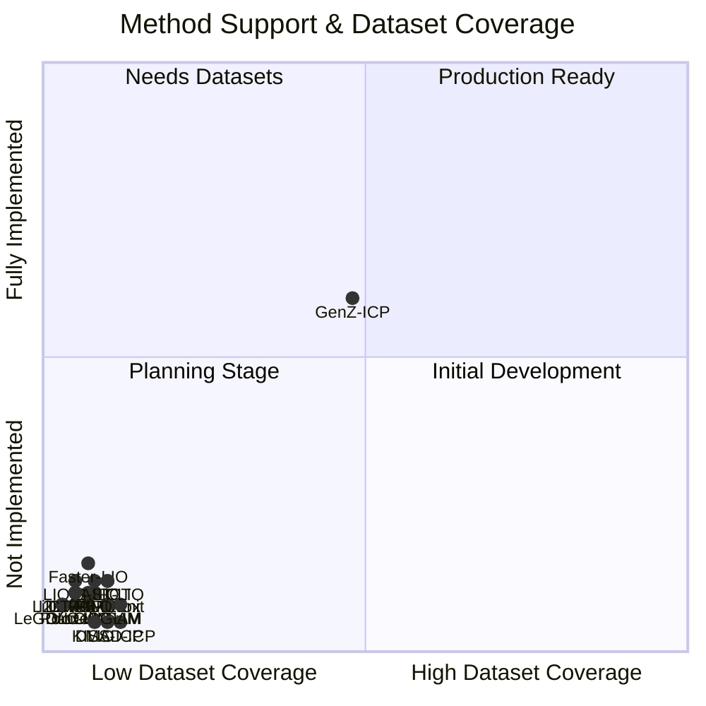

# benchmark-hdmapping

A comprehensive benchmark dataset for evaluating high-definition mapping performance across multiple LiDAR scanners and environmental conditions.

## Dataset Overview

This benchmark contains LiDAR point cloud data collected across **8 different locations** using **9 different scanner types**. The dataset is designed to evaluate HD mapping algorithms under varied environmental conditions, including different forest ages, vegetation types, and urban settings.

### Locations

- **Beech-old**: Mature beech forest environment
- **Mixture-old**: Old-growth mixed forest
- **Mixture-young**: Young mixed forest stand
- **Park**: Urban park setting with diverse sub-areas
- **Pipes**: Infrastructure/utility area
- **Spruce150x60**: Spruce plantation (150x60m plot)
- **Spruce-old**: Mature spruce forest
- **Spruce-young**: Young spruce plantation

## Visual Overview

### Dataset Directory Structure

```mermaid
graph TB
    Root[benchmark-hdmapping]
    
    Root --> Beech[Beech-old]
    Root --> MixOld[Mixture-old]
    Root --> MixYoung[Mixture-young]
    Root --> Park1[One park]
    Root --> Park2[Two parks]
    Root --> Pipes[Pipes]
    Root --> Spruce150[Spruce150x60]
    Root --> SpruceOld[Spruce-old]
    Root --> SpruceYoung[Spruce-young]
    
    subgraph B["Beech-old Scanners"]
        B1[Avia]
        B2[Hesai big]
        B3[Hesai small]
        B4[Livox HAP]
        B5[MID Arm]
        B6[MID Stick]
        B7[Ouster]
        B8[Sick]
    end
    
    subgraph MO["Mixture-old Scanners"]
        MO1[AVIA]
        MO2[Hesai big]
        MO3[hesai small]
        MO4[Livox HAP]
        MO5[MID ARM]
        MO6[MID STICK]
        MO7[Ouster]
        MO8[SICK]
    end
    
    subgraph MY["Mixture-young Scanners"]
        MY1[AVIA]
        MY2[Hesai big]
        MY3[Hesai small]
        MY4[Livox HAP]
        MY5[MID ARM]
        MY6[MID STICK]
        MY7[ouster]
        MY8[SICK]
    end
    
    subgraph PP["Pipes Scanners"]
        PP1[AVIA]
        PP2[Hesai big]
        PP3[Hesai small]
        PP4[LIVOX HAP]
        PP5[MID ARM]
        PP6[MID Stick]
        PP7[OUSTER]
        PP8[SICK]
    end
    
    subgraph S150["Spruce150x60 Scanners"]
        S150_1[AVIA]
        S150_2[hesai big]
        S150_3[Hesai small]
        S150_4[Livox HAP]
        S150_5[MID ARM]
        S150_6[MID STICK]
        S150_7[ouster]
        S150_8[SICK]
    end
    
    subgraph SO["Spruce-old Scanners"]
        SO1[AVIA]
        SO2[Hesai big]
        SO3[hesai small]
        SO4[Livox HAP]
        SO5[MID ARM]
        SO6[MID STICK]
        SO7[ouster]
        SO8[SICK]
    end
    
    subgraph SY["Spruce-young Scanners"]
        SY1[AVIA]
        SY2[hesai big]
        SY3[Hesai Small]
        SY4[Livox HAP]
        SY5[MID ARM]
        SY6[MID STICK]
        SY7[ouster]
        SY8[SICK]
    end
    
    subgraph PA1["One park"]
        PA11[Avia]
        PA12[Hesai Big]
        PA13[Hesai small]
        PA14[Livox HAP]
        PA15[MID ARM]
        PA16[MID STICK]
        PA17[Ouster]
        PA18[sick]
    end
    subgraph PA2["Two parks"]
        PA21[Avia]
        PA22[Hesai Big]
        PA23[Hesai small]
        PA24[Livox HAP]
        PA25[MID ARM]
        PA26[MID STICK]
        PA27[Ouster]
        PA28[sick]
    end
    
    Beech -.-> B
    MixOld -.-> MO
    MixYoung -.-> MY
    Park1 -.-> PA1
    Park2 -.-> PA2
    Pipes -.-> PP
    Spruce150 -.-> S150
    SpruceOld -.-> SO
    SpruceYoung -.-> SY
    
    style Root fill:#4CAF50,stroke:#2E7D32,color:#fff
    
    %% Location nodes - Light Blue
    style Beech fill:#90CAF9,stroke:#1976D2,color:#000
    style MixOld fill:#90CAF9,stroke:#1976D2,color:#000
    style MixYoung fill:#90CAF9,stroke:#1976D2,color:#000
    style Park1 fill:#90CAF9,stroke:#1976D2,color:#000
    style Park2 fill:#90CAF9,stroke:#1976D2,color:#000
    style Pipes fill:#90CAF9,stroke:#1976D2,color:#000
    style Spruce150 fill:#90CAF9,stroke:#1976D2,color:#000
    style SpruceOld fill:#90CAF9,stroke:#1976D2,color:#000
    style SpruceYoung fill:#90CAF9,stroke:#1976D2,color:#000
    
    %% AVIA/Avia scanners - Blue
    style B1 fill:#2196F3,stroke:#1565C0,color:#fff
    style MO1 fill:#2196F3,stroke:#1565C0,color:#fff
    style MY1 fill:#2196F3,stroke:#1565C0,color:#fff
    style PP1 fill:#2196F3,stroke:#1565C0,color:#fff
    style S150_1 fill:#2196F3,stroke:#1565C0,color:#fff
    style SO1 fill:#2196F3,stroke:#1565C0,color:#fff
    style SY1 fill:#2196F3,stroke:#1565C0,color:#fff
    style PA11 fill:#2196F3,stroke:#1565C0,color:#fff
    style PA21 fill:#2196F3,stroke:#1565C0,color:#fff
    
    %% Hesai Big - Red
    style B2 fill:#F44336,stroke:#C62828,color:#fff
    style MO2 fill:#F44336,stroke:#C62828,color:#fff
    style MY2 fill:#F44336,stroke:#C62828,color:#fff
    style PP2 fill:#F44336,stroke:#C62828,color:#fff
    style S150_2 fill:#F44336,stroke:#C62828,color:#fff
    style SO2 fill:#F44336,stroke:#C62828,color:#fff
    style SY2 fill:#F44336,stroke:#C62828,color:#fff
    style PA12 fill:#F44336,stroke:#C62828,color:#fff
    style PA22 fill:#F44336,stroke:#C62828,color:#fff
    
    %% Hesai Small - Pink
    style B3 fill:#E91E63,stroke:#880E4F,color:#fff
    style MO3 fill:#E91E63,stroke:#880E4F,color:#fff
    style MY3 fill:#E91E63,stroke:#880E4F,color:#fff
    style PP3 fill:#E91E63,stroke:#880E4F,color:#fff
    style S150_3 fill:#E91E63,stroke:#880E4F,color:#fff
    style SO3 fill:#E91E63,stroke:#880E4F,color:#fff
    style SY3 fill:#E91E63,stroke:#880E4F,color:#fff
    style PA13 fill:#E91E63,stroke:#880E4F,color:#fff
    style PA23 fill:#E91E63,stroke:#880E4F,color:#fff
    
    %% Livox HAP - Purple
    style B4 fill:#9C27B0,stroke:#4A148C,color:#fff
    style MO4 fill:#9C27B0,stroke:#4A148C,color:#fff
    style MY4 fill:#9C27B0,stroke:#4A148C,color:#fff
    style PP4 fill:#9C27B0,stroke:#4A148C,color:#fff
    style S150_4 fill:#9C27B0,stroke:#4A148C,color:#fff
    style SO4 fill:#9C27B0,stroke:#4A148C,color:#fff
    style SY4 fill:#9C27B0,stroke:#4A148C,color:#fff
    style PA14 fill:#9C27B0,stroke:#4A148C,color:#fff
    style PA24 fill:#9C27B0,stroke:#4A148C,color:#fff
    
    %% MID ARM - Orange
    style B5 fill:#FF9800,stroke:#E65100,color:#fff
    style MO5 fill:#FF9800,stroke:#E65100,color:#fff
    style MY5 fill:#FF9800,stroke:#E65100,color:#fff
    style PP5 fill:#FF9800,stroke:#E65100,color:#fff
    style S150_5 fill:#FF9800,stroke:#E65100,color:#fff
    style SO5 fill:#FF9800,stroke:#E65100,color:#fff
    style SY5 fill:#FF9800,stroke:#E65100,color:#fff
    style PA15 fill:#FF9800,stroke:#E65100,color:#fff
    style PA25 fill:#FF9800,stroke:#E65100,color:#fff
    
    %% MID STICK - Amber
    style B6 fill:#FFC107,stroke:#FF6F00,color:#000
    style MO6 fill:#FFC107,stroke:#FF6F00,color:#000
    style MY6 fill:#FFC107,stroke:#FF6F00,color:#000
    style PP6 fill:#FFC107,stroke:#FF6F00,color:#000
    style S150_6 fill:#FFC107,stroke:#FF6F00,color:#000
    style SO6 fill:#FFC107,stroke:#FF6F00,color:#000
    style SY6 fill:#FFC107,stroke:#FF6F00,color:#000
    style PA16 fill:#FFC107,stroke:#FF6F00,color:#000
    style PA26 fill:#FFC107,stroke:#FF6F00,color:#000
    
    %% Ouster - Green
    style B7 fill:#4CAF50,stroke:#1B5E20,color:#fff
    style MO7 fill:#4CAF50,stroke:#1B5E20,color:#fff
    style MY7 fill:#4CAF50,stroke:#1B5E20,color:#fff
    style PP7 fill:#4CAF50,stroke:#1B5E20,color:#fff
    style S150_7 fill:#4CAF50,stroke:#1B5E20,color:#fff
    style SO7 fill:#4CAF50,stroke:#1B5E20,color:#fff
    style SY7 fill:#4CAF50,stroke:#1B5E20,color:#fff
    style PA17 fill:#4CAF50,stroke:#1B5E20,color:#fff
    style PA27 fill:#4CAF50,stroke:#1B5E20,color:#fff
    
    %% SICK/Sick - Cyan
    style B8 fill:#00BCD4,stroke:#006064,color:#fff
    style MO8 fill:#00BCD4,stroke:#006064,color:#fff
    style MY8 fill:#00BCD4,stroke:#006064,color:#fff
    style PP8 fill:#00BCD4,stroke:#006064,color:#fff
    style S150_8 fill:#00BCD4,stroke:#006064,color:#fff
    style SO8 fill:#00BCD4,stroke:#006064,color:#fff
    style SY8 fill:#00BCD4,stroke:#006064,color:#fff
    style PA18 fill:#00BCD4,stroke:#006064,color:#fff
    style PA28 fill:#00BCD4,stroke:#006064,color:#fff
    
```



### Scanner Coverage Matrix

| Location | 🔵 AVIA | 🔴 Hesai Big | 🔴 Hesai Small | 🟣 Livox HAP | 🟠 MID ARM | 🟡 MID STICK | 🟢 Ouster | 🔵 SICK | **Total** |
|----------|:----:|:----------:|:------------:|:-----------:|:--------:|:----------:|:-------:|:-----:|:---------:|
| **Beech-old** | ✓ | ✓ | ✓ | ✓ | ✓ | ✓ | ✓ | ✓ | **8** |
| **Mixture-old** | ✓ | ✓ | ✓ | ✓ | ✓ | ✓ | ✓ | ✓ | **8** |
| **Mixture-young** | ✓ | ✓ | ✓ | ✓ | ✓ | ✓ | ✓ | ✓ | **8** |
| **One park** | ✓ | ✓ | ✓ | ✓ | ✓ | ✓ | ✓ | ✓ | **8** |
| **Two parks** | ✓ | ✓ | ✓ | ✓ | ✓ | ✓ | ✓ | ✓ | **8** |
| **Pipes** | ✓ | ✓ | ✓ | ✓ | ✓ | ✓ | ✓ | ✓ | **8** |
| **Spruce150x60** | ✓ | ✓ | ✓ | ✓ | ✓ | ✓ | ✓ | ✓ | **8** |
| **Spruce-old** | ✓ | ✓ | ✓ | ✓ | ✓ | ✓ | ✓ | ✓ | **8** |
| **Spruce-young** | ✓ | ✓ | ✓ | ✓ | ✓ | ✓ | ✓ | ✓ | **8** |
| **TOTAL** | **8** | **8** | **8** | **8** | **8** | **8** | **8** | **8** | **72** |

## Scanner Types

The benchmark includes data from the following LiDAR scanners:

### Scanners (present in all locations)
- **AVIA**: DJI Livox AVIA solid-state LiDAR
- **Hesai Big**: Hesai high-channel mechanical LiDAR
- **Hesai Small**: Hesai compact mechanical LiDAR
- **Livox HAP**: Livox HAP configuration
- **MID ARM**: Livox MID-360 mounted on arm configuration
- **MID STICK**: Livox MID-360 stick-mounted configuration
- **Ouster**: Ouster mechanical LiDAR
- **SICK**: SICK industrial LiDAR scanner

## Dataset Statistics

- **Total Locations**: 9
- **Total Scanner Types**: 8 unique scanner types
- **Total Unique Location-Scanner Combinations**: 72
- **Scanner Coverage**: All 8 scanners are present in all 9 locations (9/9 locations each)

## Special Notes

### Data Characteristics
TBD

## Usage

TBD

## Citation

If you use this benchmark dataset in your research, please cite:

```
[Citation information to be added]
```

## License

[License information to be added]

## Method Support Status

This quadrant chart shows the current implementation status of SLAM methods and their dataset coverage:



**Current Status:**
- ✅ **Supported**: GenZ-ICP (All 4 Livox: AVIA, MID360 Arm/Stick, HAP)
- ⏳ **In Progress**: 0 methods
- 📋 **Planned**: 19 methods (CT-ICP, DLIO, DLO, FAST-LIO, Faster-LIO, GLIM, I2EKF-LO, iG-LIO, KISS-ICP, LeGO-LOAM, LiDAR-IMU-Init, LIO-EKF, LIO-SAM, LOAM-Livox, MAD-ICP, Point-LIO, RESPLE, SLICT, VoxelMap)

**Goal**: Achieve full coverage of all 20 methods across all 72 sequences (9 locations × 8 scanners).

## Implementation Progress Tracking

### Progress by Location

Track implementation progress for each method across different locations. Values show scanners supported / total scanners available at location.

| Method | Beech-old<br>(8) | Mixture-old<br>(8) | Mixture-young<br>(8) | One park<br>(8) | Parks<br>(8) | Pipes<br>(8) | Spruce<br>150x60<br>(8) | Spruce-old<br>(8) | Spruce-young<br>(8) | **Total** |
|--------|:----:|:----:|:----:|:----:|:----:|:----:|:----:|:----:|:----:|:---------:|
| **CT-ICP** | 0/8 | 0/8 | 0/8 | 0/8 | 0/8 | 0/8 | 0/8 | 0/8 | 0/8 | **0/72** |
| **DLIO** | 0/8 | 0/8 | 0/8 | 0/8 | 0/8 | 0/8 | 0/8 | 0/8 | 0/8 | **0/72** |
| **DLO** | 0/8 | 0/8 | 0/8 | 0/8 | 0/8 | 0/8 | 0/8 | 0/8 | 0/8 | **0/72** |
| **FAST-LIO** | 0/8 | 0/8 | 0/8 | 0/8 | 0/8 | 0/8 | 0/8 | 0/8 | 0/8 | **0/72** |
| **Faster-LIO** | 0/8 | 0/8 | 0/8 | 0/8 | 0/8 | 0/8 | 0/8 | 0/8 | 0/8 | **0/72** |
| **GenZ-ICP** | 4/8 | 4/8 | 4/8 | 4/8 | 4/8 | 4/8 | 4/8 | 4/8 | 4/8 | **36/72** |
| **GLIM** | 0/8 | 0/8 | 0/8 | 0/8 | 0/8 | 0/8 | 0/8 | 0/8 | 0/8 | **0/72** |
| **I2EKF-LO** | 0/8 | 0/8 | 0/8 | 0/8 | 0/8 | 0/8 | 0/8 | 0/8 | 0/8 | **0/72** |
| **iG-LIO** | 0/8 | 0/8 | 0/8 | 0/8 | 0/8 | 0/8 | 0/8 | 0/8 | 0/8 | **0/72** |
| **KISS-ICP** | 0/8 | 0/8 | 0/8 | 0/8 | 0/8 | 0/8 | 0/8 | 0/8 | 0/8 | **0/72** |
| **LeGO-LOAM** | 0/8 | 0/8 | 0/8 | 0/8 | 0/8 | 0/8 | 0/8 | 0/8 | 0/8 | **0/72** |
| **LiDAR-IMU-Init** | 0/8 | 0/8 | 0/8 | 0/8 | 0/8 | 0/8 | 0/8 | 0/8 | 0/8 | **0/72** |
| **LIO-EKF** | 0/8 | 0/8 | 0/8 | 0/8 | 0/8 | 0/8 | 0/8 | 0/8 | 0/8 | **0/72** |
| **LIO-SAM** | 0/8 | 0/8 | 0/8 | 0/8 | 0/8 | 0/8 | 0/8 | 0/8 | 0/8 | **0/72** |
| **LOAM-Livox** | 0/8 | 0/8 | 0/8 | 0/8 | 0/8 | 0/8 | 0/8 | 0/8 | 0/8 | **0/72** |
| **MAD-ICP** | 0/8 | 0/8 | 0/8 | 0/8 | 0/8 | 0/8 | 0/8 | 0/8 | 0/8 | **0/72** |
| **Point-LIO** | 0/8 | 0/8 | 0/8 | 0/8 | 0/8 | 0/8 | 0/8 | 0/8 | 0/8 | **0/72** |
| **RESPLE** | 0/8 | 0/8 | 0/8 | 0/8 | 0/8 | 0/8 | 0/8 | 0/8 | 0/8 | **0/72** |
| **SLICT** | 0/8 | 0/8 | 0/8 | 0/8 | 0/8 | 0/8 | 0/8 | 0/8 | 0/8 | **0/72** |
| **VoxelMap** | 0/8 | 0/8 | 0/8 | 0/8 | 0/8 | 0/8 | 0/8 | 0/8 | 0/8 | **0/72** |
| **TOTAL** | **4/160** | **4/160** | **4/160** | **4/160** | **4/160** | **4/160** | **4/160** | **4/160** | **4/160** | **36/1440** |

### Progress by Scanner

Track implementation progress for each method across different scanner types. Values show locations supported / total locations available for scanner.

| Method | AVIA<br>(9) | Hesai Big<br>(9) | Hesai Small<br>(9) | Livox HAP<br>(9) | MID ARM<br>(9) | MID STICK<br>(9) | Ouster<br>(9) | SICK<br>(9) | **Total** |
|--------|:----:|:----:|:----:|:----:|:----:|:----:|:----:|:----:|:---------:|
| **CT-ICP** | 0/9 | 0/9 | 0/9 | 0/9 | 0/9 | 0/9 | 0/9 | 0/9 | **0/72** |
| **DLIO** | 0/9 | 0/9 | 0/9 | 0/9 | 0/9 | 0/9 | 0/9 | 0/9 | **0/72** |
| **DLO** | 0/9 | 0/9 | 0/9 | 0/9 | 0/9 | 0/9 | 0/9 | 0/9 | **0/72** |
| **FAST-LIO** | 0/9 | 0/9 | 0/9 | 0/9 | 0/9 | 0/9 | 0/9 | 0/9 | **0/72** |
| **Faster-LIO** | 0/9 | 0/9 | 0/9 | 0/9 | 0/9 | 0/9 | 0/9 | 0/9 | **0/72** |
| **GenZ-ICP** | 9/9 | 0/9 | 0/9 | 9/9 | 9/9 | 9/9 | 0/9 | 0/9 | **36/72** |
| **GLIM** | 0/9 | 0/9 | 0/9 | 0/9 | 0/9 | 0/9 | 0/9 | 0/9 | **0/72** |
| **I2EKF-LO** | 0/9 | 0/9 | 0/9 | 0/9 | 0/9 | 0/9 | 0/9 | 0/9 | **0/72** |
| **iG-LIO** | 0/9 | 0/9 | 0/9 | 0/9 | 0/9 | 0/9 | 0/9 | 0/9 | **0/72** |
| **KISS-ICP** | 0/9 | 0/9 | 0/9 | 0/9 | 0/9 | 0/9 | 0/9 | 0/9 | **0/72** |
| **LeGO-LOAM** | 0/9 | 0/9 | 0/9 | 0/9 | 0/9 | 0/9 | 0/9 | 0/9 | **0/72** |
| **LiDAR-IMU-Init** | 0/9 | 0/9 | 0/9 | 0/9 | 0/9 | 0/9 | 0/9 | 0/9 | **0/72** |
| **LIO-EKF** | 0/9 | 0/9 | 0/9 | 0/9 | 0/9 | 0/9 | 0/9 | 0/9 | **0/72** |
| **LIO-SAM** | 0/9 | 0/9 | 0/9 | 0/9 | 0/9 | 0/9 | 0/9 | 0/9 | **0/72** |
| **LOAM-Livox** | 0/9 | 0/9 | 0/9 | 0/9 | 0/9 | 0/9 | 0/9 | 0/9 | **0/72** |
| **MAD-ICP** | 0/9 | 0/9 | 0/9 | 0/9 | 0/9 | 0/9 | 0/9 | 0/9 | **0/72** |
| **Point-LIO** | 0/9 | 0/9 | 0/9 | 0/9 | 0/9 | 0/9 | 0/9 | 0/9 | **0/72** |
| **RESPLE** | 0/9 | 0/9 | 0/9 | 0/9 | 0/9 | 0/9 | 0/9 | 0/9 | **0/72** |
| **SLICT** | 0/9 | 0/9 | 0/9 | 0/9 | 0/9 | 0/9 | 0/9 | 0/9 | **0/72** |
| **VoxelMap** | 0/9 | 0/9 | 0/9 | 0/9 | 0/9 | 0/9 | 0/9 | 0/9 | **0/72** |
| **TOTAL** | **9/180** | **0/180** | **0/180** | **9/180** | **9/180** | **9/180** | **0/180** | **0/180** | **36/1440** |

**Legend:**
- Values shown as `supported/available` (e.g., 1/9 means 1 out of 9 available combinations supported)
- **Bold totals** show cumulative progress
- Total possible combinations: 1440 (20 methods × 72 sequences)
